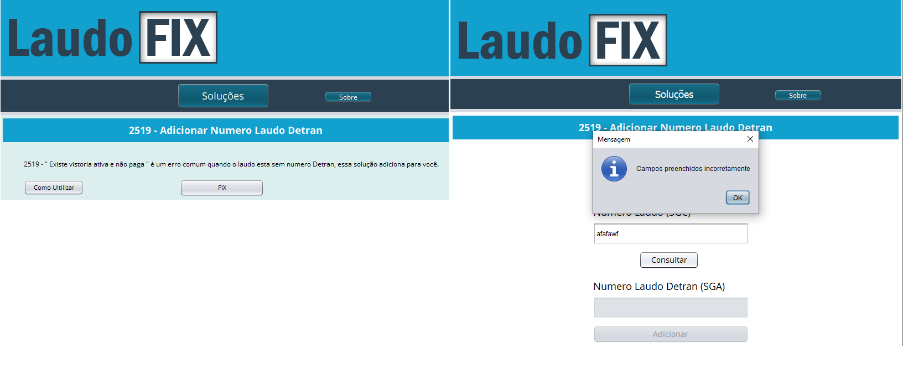

# Laudo Fix

Projeto realizado para empresa de tecnologia terceirizada ao DETRAN, onde havia a necessidade de um programa que se comunicasse direto com o banco de dados. Essa aplicação tem uma serie de validações necessarias antes de atualizar diretamente o DB, permitindo os atendentes realizarem a alteração necessaria sem que ocorra o riscos.

<h1 align="center">

### Tecnologias ultilizadas

- Java  (JDBC, SWING)
- Postgree SQL
